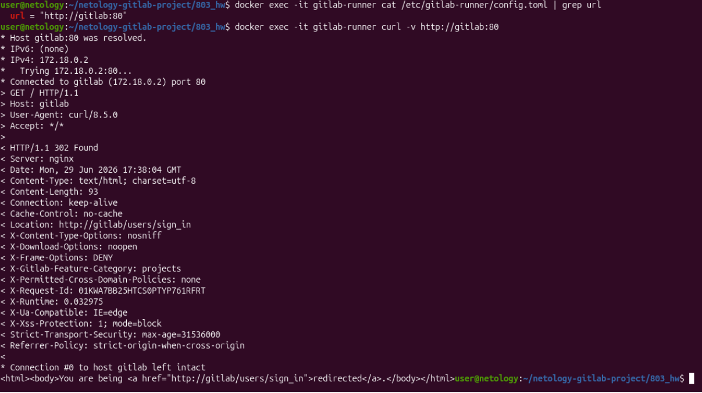
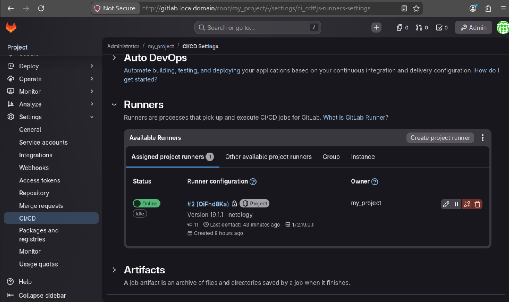
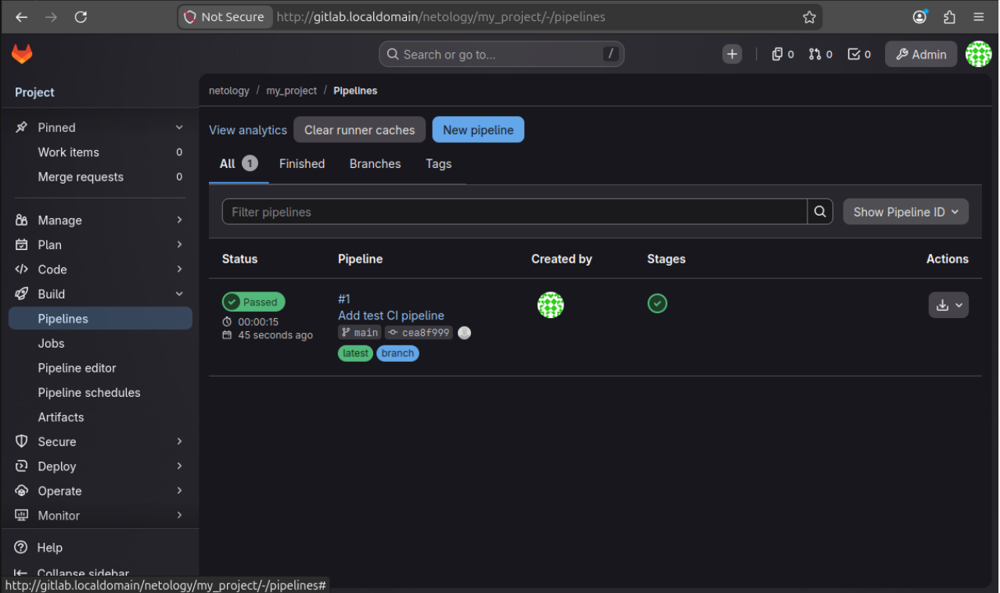
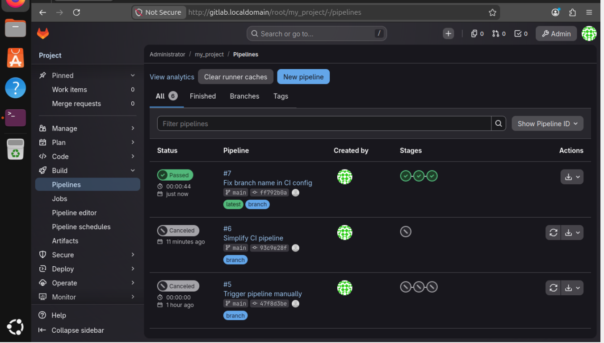

\# Домашнее задание к занятию "`Название занятия`" - `Фамилия и имя студента`


### Инструкция по выполнению домашнего задания

   1. Сделайте `fork` данного репозитория к себе в Github и переименуйте его по названию или номеру занятия, например, https://github.com/имя-вашего-репозитория/git-hw или  https://github.com/имя-вашего-репозитория/7-1-ansible-hw).
   2. Выполните клонирование данного репозитория к себе на ПК с помощью команды `git clone`.
   3. Выполните домашнее задание и заполните у себя локально этот файл README.md:
      - впишите вверху название занятия и вашу фамилию и имя
      - в каждом задании добавьте решение в требуемом виде (текст/код/скриншоты/ссылка)
      - для корректного добавления скриншотов воспользуйтесь [инструкцией "Как вставить скриншот в шаблон с решением](https://github.com/netology-code/sys-pattern-homework/blob/main/screen-instruction.md)
      - при оформлении используйте возможности языка разметки md (коротко об этом можно посмотреть в [инструкции  по MarkDown](https://github.com/netology-code/sys-pattern-homework/blob/main/md-instruction.md))
   4. После завершения работы над домашним заданием сделайте коммит (`git commit -m "comment"`) и отправьте его на Github (`git push origin`);
   5. В личном кабинете прикрепите и отправьте ссылку на решение в виде md-файла в вашем Github.
   6. Любые вопросы по выполнению заданий спрашивайте в разделе “Вопросы по заданию” в личном кабинете.
   
Желаем успехов в выполнении домашнего задания!
   
### Дополнительные материалы, которые могут быть полезны для выполнения задания

1. [Руководство по оформлению Markdown файлов](https://gist.github.com/Jekins/2bf2d0638163f1294637#Code)

---

### Задание 1: Развертывание GitLab и GitLab Runner

#### Что было сделано:
1. Развернут GitLab в Docker-контейнере.
2. Зарегистрирован и запущен GitLab Runner в режиме Docker.
3. Настроена сеть между контейнерами для корректной работы.
4. Раннер привязан к проекту `my_project`.

#### Скриншоты:
##### Настройки раннера в проекте:


##### Статус раннера (online):


##### Res:


---

### Задание 2: Создание и запуск CI/CD пайплайна

#### Скриншоты:


#### Файл `.gitlab-ci.yml`:

```yaml
stages:
  - build
  - test
  - deploy

variables:
  APP_NAME: "my_project"

build-job:
  stage: build
  script:
    - echo "Building the application..."
    - mkdir -p build
    - echo "Build completed at $(date)" > build/info.txt
  artifacts:
    paths:
      - build/

test-job:
  stage: test
  script:
    - echo "Running tests..."
    - echo "All tests passed successfully!"
  dependencies:
    - build-job

deploy-job:
  stage: deploy
  script:
    - echo "Deploying the application..."
    - echo "Deployment completed at $(date)"
  dependencies:
    - build-job
  only:
    - main
